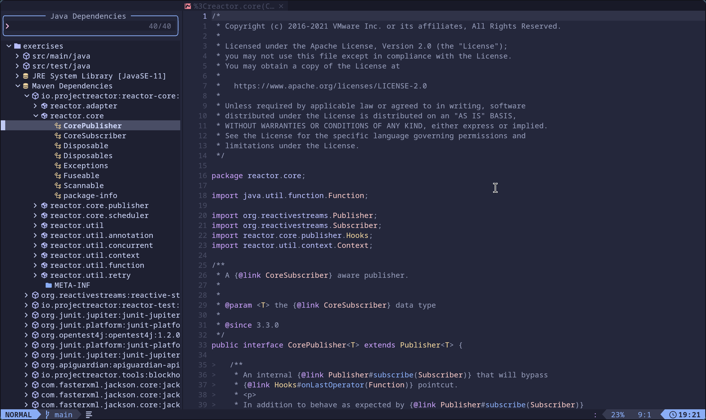

# java-deps.nvim

A Neovim plugin for viewing Java project dependencies, inspired by [vscode-java-dependency](https://github.com/microsoft/vscode-java-dependency).

## Features

- View project dependencies in a tree structure.
- Expand and collapse dependency nodes.
- Use `jdtls` to get dependency information.
- Use `snacks.nvim` to build the UI.

## Screenshot



## Installation

### jdtls

Ensure that the `com.microsoft.jdtls.ext.core` extension jar from `vscode-java-dependency` is loaded into your `jdtls`.

- If you have `vscode-java-dependency` installed in VS Code, it is located at `.vscode/extensions/vscjava.vscode-java-dependency-{{version}}-universal/server/com.microsoft.jdtls.ext.core-{{version}}.jar`
- Install the vscode-java-dependency package via mason.

```lua
local java_deps_path = require("mason-registry")
    .get_package("vscode-java-dependency")
    :get_install_path() .. "/extension/server/com.microsoft.jdtls.ext.core-*.jar"
-- or
local java_deps_path = ".vscode/extensions/vscjava.vscode-java-dependency-{{version}}-universal/server/com.microsoft.jdtls.ext.core-{{version}}.jar"
```

#### nvim-jdtls example configuration

```lua
-- Add the vscode-java-dependency jdtls extension jar
local jdtls_config = {
  bundles = { java_deps_path }
}
```

#### nvim-lspconfig example configuration

```lua
-- Add the vscode-java-dependency jdtls extension jar
require("lspconfig").jdtls.setup {
  init_options = {
    bundles = { java_deps_path },
  },
}
```

### [lazy.nvim](https://github.com/folke/lazy.nvim)

```lua
{
  {
    "g0ne150/java-deps.nvim",
    dependencies = {
      "folke/snacks.nvim",
      {
        "mason-org/mason.nvim",
        opts = { ensure_installed = { "vscode-java-dependency" } },
      },
    },
    config = function()
    end,
  },
}
```

## Usage

- Run `:JavaDepsView` to open the dependency view.
- Run `:JavaDepsViewRefresh` to clear the cache and refresh the dependency view. This is useful when you have updated your dependencies in `pom.xml` or `build.gradle`.

### Keybindings

- `h`: Collapse the current node. If the current node is already collapsed or cannot be expanded, collapse the parent node.
- `l`/`o`/`<CR>`: Expand the current node.

## Acknowledgements

- [vscode-java-dependency](https://github.com/microsoft/vscode-java-dependency): Provided the initial idea and the `jdtls` extension.
- [snacks.nvim](https://github.com/folke/snacks.nvim): Provided the powerful picker UI framework.

## License

[MIT](./LICENSE)
