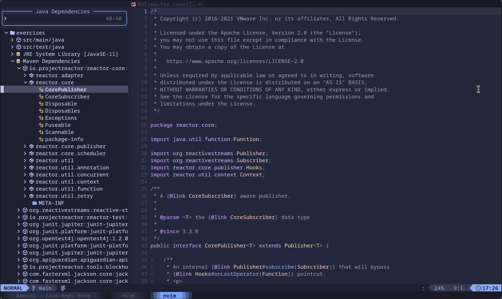

# java-deps.nvim

一个用于查看 Java 项目依赖的 Neovim 插件，灵感来源于 [vscode-java-dependency](https://github.com/microsoft/vscode-java-dependency)。

## 功能

- 以树状结构查看项目依赖。
- 展开和折叠依赖节点。
- 使用 `jdtls` 获取依赖信息。
- 使用 `snacks.nvim` 构建 UI。

## 截图



## 安装

### jdtls

确保 vscode-java-dependency 中的 com.microsoft.jdtls.ext.core 扩展 jar 包已经加载到你的 jdtls 中。

- 如果你的 vscode 安装了 vscode-java-dependency，则位于 `.vscode/extensions/vscjava.vscode-java-dependency-{{version}}-universal/server/com.microsoft.jdtls.ext.core-{{version}}.jar`
- 我最近发起了一个 [pull request](https://github.com/mason-org/mason-registry/pull/10719)，希望把 vscode-java-dependency 作为依赖项加入到 mason-registry 中。

```lua
local java_deps_path = require("mason-registry")
    .get_package("vscode-java-dependency")
    :get_install_path() .. "/extension/server/com.microsoft.jdtls.ext.core-*.jar"
-- or
local java_deps_path = ".vscode/extensions/vscjava.vscode-java-dependency-{{version}}-universal/server/com.microsoft.jdtls.ext.core-{{version}}.jar"
```

#### nvim-jdtls 参考配置

```lua
-- 添加 vscode-java-dependency jdtls 扩展 jar 包
local jdtls_config = {
  bundles = { java_deps_path }
}
```

#### nvim-lspconfig 参考配置

```lua
-- 添加 vscode-java-dependency jdtls 扩展 jar 包
require("lspconfig").jdtls.setup {
  init_options = {
    bundles = { java_deps_path },
  },
}
```

### [lazy.nvim](https://github.com/folke/lazy.nvim)

```lua
{
  "g0ne150/java-deps.nvim",
  dependencies = { "folke/snacks.nvim" },
  config = function()
    -- 无需设置，插件在命令调用时加载
  end,
}
```

## 使用

- 运行 `:JavaDepsView` 打开依赖视图。

### 快捷键

- `h`: 折叠当前节点。如果当前节点已经折叠或无法展开，则折叠父节点。
- `l`/`o`/`<CR>`: 展开当前节点。

## 致谢

- [vscode-java-dependency](https://github.com/microsoft/vscode-java-dependency): 提供了最初的想法和 `jdtls` 扩展。
- [snacks.nvim](https://github.com/folke/snacks.nvim): 提供了强大的选择器 UI 框架。

## 许可证

[MIT](./LICENSE)
